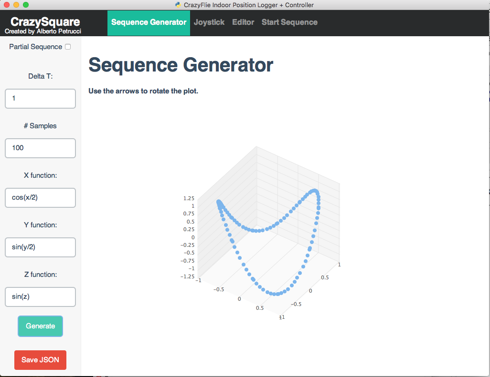

### Crazyflie Indoor Position Logger Controller
is a tool developed for two main reasons:
- to get estimated position from the crazyflie
- to control the quadcopter so that it follow a generated path

The software is composed by three different part:
- a simple GUI for the user
- a logger
- a controller (in this case an offline LQR controller)

### The GUI
The user interface is mainly composed by three pages:
- the first one used to generate the desired path


- the second one to connect with a PS3 JoyStick


- the third one to configure the main setup of the logger and the controller.


The configuration is done by two different json files `config.json` and `sequence.json`. The first one, `config.json`, has the following structure:
```markdown
{
	"crazyflies": [
		{
			"name": "Object-0",
			"link": "radio://0/120/2M"
		}
	],
	"nodes": [
		[0.00, 0.00, 2.17],
		[2.10, 0.60, 0.64],
		[2.77, 2.75, 1.85],
		[1.18, 3.01, 0.77]
	],
	"autoconnect": 1,
	"show_realtime_plots": 0
}
```
Where:
- **crazyflies:** contains a list of pair ({name=optional}, {link=the uri of the crazyflie}) 
- **nodes:** contains all the position of the nodes into the room
- **autoconnect:** is a boolean value (if 1 the app will connect to the crazyflie automatically)
- **show_realtime_plots:** is a boolean value (if 1 two plot related to the position and the attitude will be shown)

The second one (`sequence.json`), instead simply contains a list of point in 4D ([x, y, z]-coords + time in seconds). So for example the list can be:
```markdown
[
  [0.640, 1.11, 1.7, 1],
  [0.704, 1.11, 1.7, 1],
  [0.768, 1.11, 1.7, 1]
]
```
this list can be simply generated throught the first page of the GUI.

### Logger + Controller
This is a the main interface of the logger and the controller:

In particular:
- the red sphere are the nodes
- the green sphere is the current setpoint
- the cube is the crazyflie

The main file that implements our virtual quadcopter is `drone_quaternion.py`. It is composed by three different parts:
- LQR controller
- NonLinear Observer of the quadcopter model
- Quadcopter model (useful for prediction but not used in this moment)

## Mathematical Model
The state of the drone is the following: [q0, q1, q2, q3, wx, wy, wz, px, py, pz, vx, vy, vz]'.
Where:
- [q0, q1, q2, q3] are the quaternions
- [wx, wy, wz] the angular velocities
- [px, py, pz] the linear position
- [vx, vy, vz] the linear velocity

### Installation

Simply clone/download the repo and execute on a terminal:
```markdown
git clone https://github.com/capriele/Crazyflie-Indoor-Position-Logger-Controller.git
cd Crazyflie-Indoor-Position-Logger-Controller
python app.py
```
Probably you need to install some library to run the project. This is the main list of the software i have installed:
- panda3D
- htmlPy + PyQt
- scipy + control + slycot python packages

```markdown
Syntax highlighted code block

# Header 1
## Header 2
### Header 3

- Bulleted
- List

1. Numbered
2. List

**Bold** and _Italic_ and `Code` text

[Link](url) and 
```

For more details see [GitHub Flavored Markdown](https://guides.github.com/features/mastering-markdown/).

### Support or Contact

If you have same trouble with this app please contact me at: [Email](petrucci.alberto@gmail.com).

