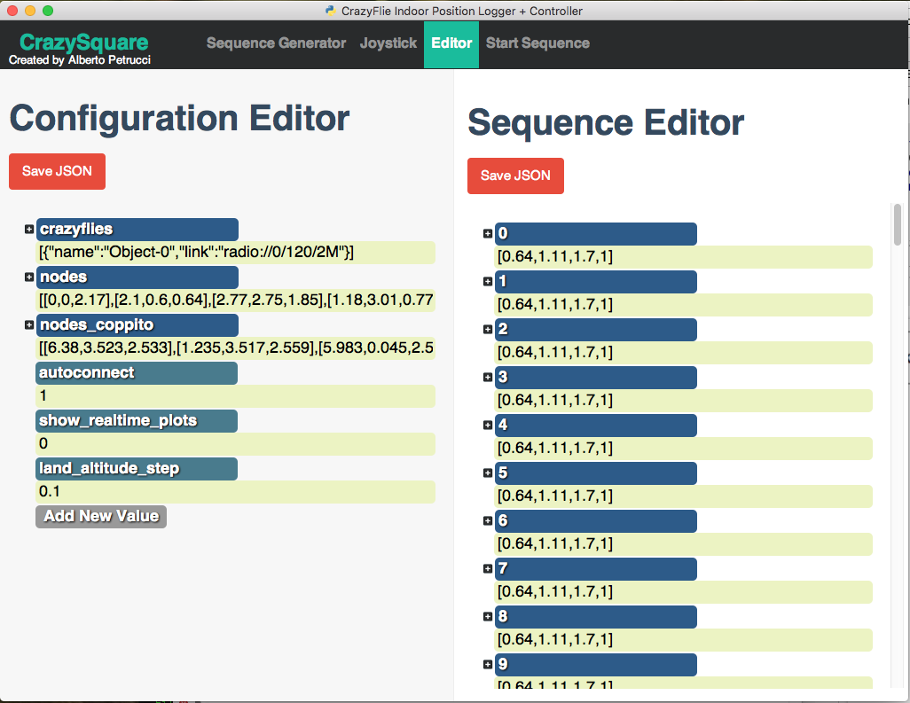

### Crazyflie Indoor Position Logger Controller
is a tool developed for two main reasons:
- to get estimated position from the crazyflie
- to control the quadcopter so that it follow a generated path

if you like this project leave a star (:star:). Thanks!

The software is composed by three different part:
- a simple GUI for the user
- a logger
- a controller (in this case an offline LQR controller or an offline BackStepping controller)

## The GUI
The user interface is mainly composed by three pages:
- the first one used to generate the desired path


- the second one to connect with a PS3 JoyStick


- the third one to configure the main setup of the logger and the controller.


The configuration is done by two different json files `config.json` and `sequence.json`. The first one, `config.json`, has the following structure:
```
{
	"crazyflies": [
	  {
	    "name": "Object-0",
	    "link": "radio://0/120/2M"
	  }
	],
	"nodes": [
		[0.00, 0.00, 2.17],
		[2.10, 0.60, 0.64],
		[2.77, 2.75, 1.85],
		[1.18, 3.01, 0.77]
	],
	"autoconnect": 1,
	"show_realtime_plots": 0,
	"land_altitude_step": 0.1
}
```
Where:
- **crazyflies:** contains a list of pair ({name=optional}, {link=the uri of the crazyflie}) 
- **nodes:** contains all the position of the nodes into the room
- **autoconnect:** is a boolean value (if 1 the app will connect to the crazyflie automatically)
- **show_realtime_plots:** is a boolean value (if 1 two plot related to the position and the attitude will be shown)
- **land_altitude_step:** altitude step during landing operation in meters (default: 0.1[m] = 10[cm])

The second one (`sequence.json`), instead simply contains a list of point in 4D ([x, y, z]-coords + time in seconds). So for example the list can be:
```
[
  [0.640, 1.11, 1.7, 1],
  [0.704, 1.11, 1.7, 1],
  [0.768, 1.11, 1.7, 1]
]
```
this list can be simply generated throught the first page of the GUI.

## Logger + Controller
This is a the main interface of the logger and the controller:


In particular:
- the red sphere are the uwb-nodes
- the green sphere is the current setpoint
- the cube is the crazyflie

The main file that implements our virtual quadcopter is `drone_quaternion.py`. It is composed by three different parts:
- LQR controller
- NonLinear Observer of the quadcopter model
- Quadcopter model (useful for prediction but not used in this moment)

## Mathematical Model
The state of the drone is the following: [q0, q1, q2, q3, wx, wy, wz, px, py, pz, vx, vy, vz]'.
Where:
- [q0, q1, q2, q3] are the quaternions
- [wx, wy, wz] are the angular velocities
- [px, py, pz] are the linear position
- [vx, vy, vz] are the linear velocity

In terms of mathematical equation:

	%Quaternion dynamics matrix
	Q = [
	-q(2) -q(3) -q(4);
	 q(1) -q(4)  q(3);
	 q(4)  q(1) -q(2);
	-q(3)  q(2)  q(1)
	];

	%Rotation matrix
	R = [
	 q(1)*q(1)+q(2)*q(2)-q(3)*q(3)-q(4)*q(4), 2*q(2)*q(3)-2*q(1)*q(4), 2*q(2)*q(4)+2*q(1)*q(3);
	 2*q(2)*q(3)+2*q(1)*q(4), q(1)*q(1)-q(2)*q(2)+q(3)*q(3)-q(4)*q(4), 2*q(3)*q(4)-2*q(1)*q(2);
	 2*q(2)*q(4)-2*q(1)*q(3), 2*q(3)*q(4) + 2*q(1)*q(2), q(1)*q(1)-q(2)*q(2)-q(3)*q(3)+q(4)*q(4);
	];

	%Skew matrix
	M = [
	 0 -omega(3) omega(2); 
	 omega(3) 0 -omega(1); 
	 -omega(2) omega(1) 0
	 ];

	%Inertia matrix
	J = [
	 m*d^2 0 0;
	 0 m*d^2 0;
	 0 0 2*m*d^2
	];

	%Total force on z-axis
	F_b = [0 0 F_tot]';
	
	%State dynamics
	q_dot = 0.5*Q*omega; 
	w_dot = drone.Mat_Jinv*(u(2:4)-M*J*omega);
	p_dot = v;
	v_dot = (1/m)*(R*F_b) - [0 0 g]';

Where the costants have the following values:

	g = 9.81;  %gravity acceleration in [m/s^2]
	m = 0.027; %drone mass in [Kg]
	d = (65.0538/1000)*sin(pi/4); %distance between motor's center and quadcopter's center in [m]

## Control
After the linearization around a stability point we can calculate the LQR gain matrix (`K`). However inside the model the input vector is composed by 4 components:

	[
	F1+F2+F3+F4; //total thrust
	Mx;          //moment around x-axis
	My;          //moment around y-axis
	Mz;          //moment around z-axis
	]

while the crazyflie accepts only the tuple (roll, pitch, yaw, thrust) for setpoints. So we need to convert these input in that way:

	scale = 65536.0 / (f_max * 4)
	u[0, 0] = u[0, 0]*scaleFactor
	u[1, 0] = (u[1, 0]/2.0)/self.d
	u[2, 0] = (u[2, 0]/2.0)/self.d
	u[3, 0] = u[3, 0]/self.c

	#m1 = u[0, 0] - u[1, 0] + u[2, 0] + u[3, 0]
	#m2 = u[0, 0] - u[1, 0] - u[2, 0] - u[3, 0]
	#m3 = u[0, 0] + u[1, 0] - u[2, 0] + u[3, 0]
	#m4 = u[0, 0] + u[1, 0] + u[2, 0] - u[3, 0]

so we can get the right (roll, pitch, thrust) in that way:

	t = (m1 + m2 + m3 + m4)/4 = u[0, 0]
	r = (m4 + m3 - m2 - m1)   = 4*u[1, 0]
	p = (m1 + m4 - m2 - m3)   = 4*u[2, 0]

after we can send this command to the crazyflie with the `cflib`

	self._cf.commander.send_setpoint(r, p, 0, int(t))

## NonLinear Observer
The NonLinear Observer was developed according: [Link](http://ing.univaq.it/manes/FilesLavoriPDF/R002_Observer_NonlinAn-TMeA_97.pdf)

## Important Variables
If there are some problems with the control you can change control's gain in the file `drone_quaternion.py`:

	self.thrustGain = 1.34 #gain for the conversion of force in thrust

#### LQR Gains
These are the main gains for the LQR-controller that you can change going to the top of the `__init__(...)` function inside `drone_quaternion.py`:

	self.beta1 = 0.3  #gain for quaternions dynamics
        self.beta2 = 0.3  #gain for angular speeds
        self.beta3x = 5.0 #gain for position coord-x
        self.beta3y = 5.0 #gain for position coord-y
        self.beta3z = 1.0 #gain for position coord-z
        self.beta4 = 0.2  #gain for linear speeds
        self.beta = 500   #gain for the inputs
	
#### BackStepping Gains
These are the main gains for the BackStepping-controller that you can change going to the function `backstepping(...)` inside `drone_quaternion.py`:

	# Controllers Parameters
        c1 = 6.11 #gain for roll
        c3 = 6.11 #gain for pitch
        c5 = 6.11 #gain for yaw
        c7 = 6.11 #gain for z
        c2 = 7.96 #gain for roll
        c4 = 7.96 #gain for pitch
        c6 = 7.96 #gain for yaw
        c8 = 7.96 #gain for z

        # Levante Derivator Gains
        L1 = -10
        L2 = -60

## Installation

Simply clone/download the repo and execute on a terminal:

	git clone https://github.com/capriele/Crazyflie-Indoor-Position-Logger-Controller.git
	cd Crazyflie-Indoor-Position-Logger-Controller
	python app.py

Probably you need to install some library to run the project. This is the main list of the software i have installed:
- panda3D [1.9.3], [Download](http://www.panda3d.org/download.php?sdk&version=1.9.3)
- htmlPy + PyQt + PySide + Jinja2
- PyGame
- scipy + control + slycot python packages

You can install the previous packages with these commands:
	
	[sudo] pip install htmlPy
	[sudo] pip install PySide or [sudo] apt-get install python-pyside
	[sudo] pip install PyQt or [sudo] apt install python-qt4
	[sudo] pip install PyGame
	[sudo] pip install scipy
	[sudo] pip install control
	[sudo] pip install slycot
	[sudo] pip install jinja2

If you have some trouble during the slycot installation install it from source following this [link](https://github.com/python-control/Slycot)

## Crazyflie firmware
This software requires some log variables from the crazyflie; so you should simply add the following code at the end of the file `stabilizer.c` inside `/src/modules/src` directory. You can consider to edit directly the [official firmware](https://github.com/bitcraze/crazyflie-firmware)

	LOG_GROUP_START(state)
	LOG_ADD(LOG_FLOAT, q0, &state.attitudeQuaternion.w)
	LOG_ADD(LOG_FLOAT, q1, &state.attitudeQuaternion.x)
	LOG_ADD(LOG_FLOAT, q2, &state.attitudeQuaternion.y)
	LOG_ADD(LOG_FLOAT, q3, &state.attitudeQuaternion.z)
	LOG_ADD(LOG_FLOAT, wx, &sensorData.gyro.x)
	LOG_ADD(LOG_FLOAT, wy, &sensorData.gyro.y)
	LOG_ADD(LOG_FLOAT, wz, &sensorData.gyro.z)
	LOG_ADD(LOG_FLOAT, px, &state.position.x)
	LOG_ADD(LOG_FLOAT, py, &state.position.y)
	LOG_ADD(LOG_FLOAT, pz, &state.position.z)
	LOG_ADD(LOG_FLOAT, vx, &state.velocity.x)
	LOG_ADD(LOG_FLOAT, vy, &state.velocity.y)
	LOG_ADD(LOG_FLOAT, vz, &state.velocity.z)
	LOG_GROUP_STOP(state)

## Support or Contact

If you have same trouble with this app please contact me at: [petrucci.alberto@gmail.com](mailto:petrucci.alberto@gmail.com).

**Please leave the signature into the navbar or in the top of the files.**

## TODO List
- [x] Offline LQR Control
- [x] Offline Backstepping Control
- [x] Online Backstepping Control (in progress)
